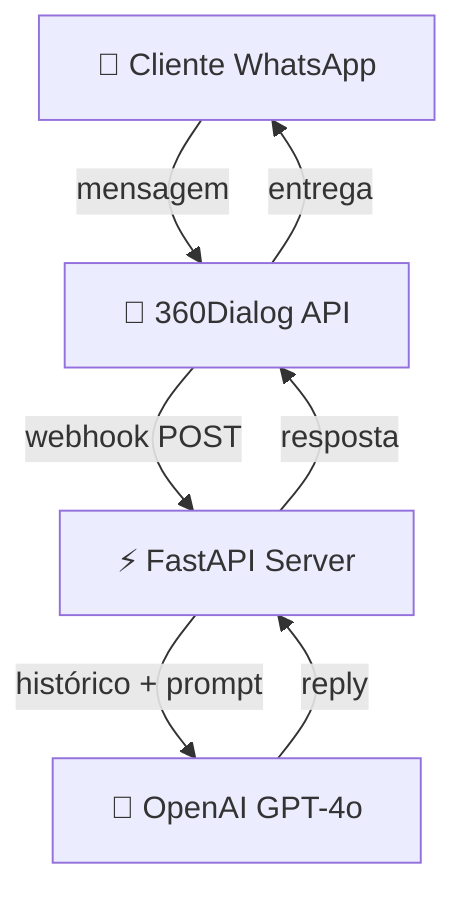

<div align="center">

<br/>

# Hi 👋 I'm Luís Otávio Guero

### Engenharia Aeroespacial · UFSM (2023–presente) · Python + Embedded Systems Developer

🥇 2x Campeão Nacional OBSAT · 🛰️ CubeSat lançado em foguete sub-orbital · 📍 Santa Maria, RS — Brasil

<br/>

## 🔗 Connect with Me

[](https://linkedin.com/in/luisotavioguero)
[](https://github.com/zyzerkk)
[](mailto:contatoguero@gmail.com)

<br/>

## 🧠 Tech Stack

**Linguagens**
<br/>


**Backend & APIs**
<br/>


**Frontend**
<br/>


**Banco de Dados**
<br/>


**Embedded, Hardware & IA**
<br/>


**Testes & Ferramentas**
<br/>


<br/>

## 📊 GitHub Analytics


<br/>

## 🐍 Contribution Graph


<br/>

</div>

---

## 🕓 Atividade Recente

### 🧠 NVIDIA Modulus — Digital Twins & Physics-ML
**`UFSM · GEDRE (Grupo de Estudos de Reatores Eletrônicos)`** · em andamento

Projeto Python aplicado a **Digital Twins com IA**, dentro da iniciativa de Comunicação por Luz Visível (VLC) do GEDRE. O foco é usar o **NVIDIA Modulus** (framework de Physics-Informed Machine Learning) para modelar e simular sistemas físicos.

| Etapa | Status |
|:---|:---:|
| Tentativa inicial no Visual Studio Code | ❌ Abandonada — sem tutoriais compatíveis |
| Migração para Google Colab (Python + GPU) | ✅ Concluída |
| Contorno de link quebrado no GitLab da Nvidia | ✅ Resolvido via fóruns e comunidades |
| Clonagem do repositório com token de acesso pessoal | ✅ Concluída |
| Instalação das dependências (`setup.py install`) | ✅ Concluída |
| Downgrade de versão do Python no Colab | 🟠 Em andamento |
| Execução do exemplo oficial da Nvidia | ⏳ Próximo passo |

```bash
# Ambiente: Google Colab (Python + GPU)
!git clone https://<username>:<token>@gitlab.com/nvidia/modulus/modulus.git
%cd ./modulus/
!python setup.py install
```

**Próximos passos:** finalizar o downgrade do Python, rodar o exemplo oficial da Nvidia até a conclusão, validar o ambiente e consolidar o entendimento dos conceitos-base do Modulus, e testar exemplos adicionais de aplicações.

---

## 💼 Experiência Profissional

### Zucchetti Software e Sistemas — Suporte Técnico N1 → N3
`2021 – presente · +4 anos`

Iniciei no N1 e em **6 meses fui convidado a criar e liderar a equipe N2**. Promovido a **N3** pela capacidade de resolver problemas críticos que demandavam conhecimento profundo de banco de dados, comportamento de sistema e debugging avançado.

**Responsabilidades N3:**
- Correção de bugs em sistemas de gestão fiscal (ERP)
- Restauração de bancos de dados corrompidos via IBExpert
- Reparos em tabelas e índices no Firebird (FDB)
- Análise de logs e relatórios técnicos para diagnóstico de falhas
- Liderança técnica do time N2

**Especialidade — Migração e Conversão de Banco de Dados** `6 meses dedicados`:

```sql
-- Pipeline de migração desenvolvido e executado em produção

-- 1. FDB → FDB: reestruturação de schema sem perda de dados
BACKUP DATABASE 'origem.fdb' TO 'backup.fbk';
RESTORE DATABASE 'backup.fbk' TO 'destino.fdb' PAGE_SIZE 8192;

-- 2. PostgreSQL → FDB: conversão de tipos e charset
-- PSQL uuid → FDB CHAR(36), PSQL jsonb → FDB BLOB SUB_TYPE TEXT

-- 3. CSV → FDB: importação massiva com validação
-- Limpeza de encoding (UTF-8/latin-1), normalização de datas

-- 4. MySQL → FDB: mapeamento de engines e collations
-- AUTO_INCREMENT → BEFORE INSERT trigger + NEXT VALUE FOR gen

-- 5. GDB → FDB: atualização de versão Firebird
```

**Ferramentas dominadas:** IBExpert · DB Visualizer · SQL Server · MySQL Workbench · MongoDB Compass · pgAdmin

---

## 🚀 Projetos

### 🛰️ OBSAT — CubeSat Meteorológico · Equipe Halley


Capitão, programador e desenvolvedor estrutural de um **CubeSat meteorológico** para detecção antecipada de tornados e ciclones tropicais em Santa Catarina. Projeto desenvolvido do zero, evoluindo por 4 fases até o lançamento real.

**Arquitetura do sistema:**

| Subsistema | Tecnologia | Especificação |
|:---|:---|:---|
| Computador de Bordo | PION Labs (C++) | Orquestra todos os módulos |
| Comunicação RF | LoRa 433 MHz · Helicoidal | 30 dBi · 100mm · 280g |
| Posicionamento | GPS + TinyGPS++ | Lat, Long, Alt, Velocidade em tempo real |
| Sensoriamento | C++/Arduino IDE | Temp, Pressão, CO₂, Acelerômetro XYZ, Giroscópio XYZ |
| Armazenamento | Cartão SD duplo (backup) | CSV organizado + backup redundante |
| Estrutura | Alumínio Aeronáutico 7075 | 100×100×100 mm · 420 g · Etaflon térmico |

**Testes de qualificação realizados:**

| Teste | Condição | Resultado |
|:---|:---|:---:|
| ❄️ Criogênico | Gelo seco → −33.33 °C | ✅ Nenhum dano |
| 🔥 Térmico | Secador → +50.65 °C | ✅ Nenhum dano |
| 🌌 Vácuo | 946 mbar → 6 mbar por 120s (parceria BRF) | ✅ Aprovado |
| 📳 Vibração | Simulação shaker, 5 repetições | ✅ Estrutura intacta |
| 🧲 Magnético | Magnetômetro x:−25.7 y:80.7 µT | ✅ Funcional |
| 💡 Luminosidade | 0% → 102% | ✅ Sensor calibrado |
| 🎈 Voo | Balão atmosférico ~40 km de altitude | ✅ Satélite ativo |

<details>
<summary><b>Ver código embarcado — telemetria, CSV e RF LoRa</b></summary>

```cpp
#include "PION_System.h"
#include <WiFi.h>
#include <HTTPClient.h>
#include "FS.h"
#include <PION_Storage.h>
#include <ArduinoJson.h>
#include <SoftwareSerial.h>
#include <HardwareSerial.h>
#include <TinyGPS++.h>

TinyGPSPlus gps;
SoftwareSerial loraSerial(2, 3); // TX, RX

void loop() {
  DynamicJsonDocument jsonBuffer(512);
  jsonBuffer["equipe"]      = TEAM_NUM;
  jsonBuffer["bateria"]     = cubeSat.getBattery();
  jsonBuffer["temperatura"] = cubeSat.getTemperature();
  jsonBuffer["pressao"]     = cubeSat.getPressure();
  jsonBuffer["co2"]         = cubeSat.getCO2Level();

  JsonArray accel = jsonBuffer.createNestedArray("acelerometro");
  accel.add(cubeSat.getAccelerometer(0));
  accel.add(cubeSat.getAccelerometer(1));
  accel.add(cubeSat.getAccelerometer(2));

  while (Serial1.available()) {
    char cIn = Serial1.read();
    gps.encode(cIn);
    payload.add("Latitude: "  + String(gps.location.lat(), 4));
    payload.add("Longitude: " + String(gps.location.lng(), 4));
  }
}
```

**Antena selecionada: Helicoidal** — 433 MHz · 30 dBi · 280g · 100mm altura × 66mm diâmetro, escolhida pela alta direcionalidade e ganho para comunicação sub-órbita → terra, com trade-off de fragilidade a vibrações mitigado por isolamento estrutural.

</details>

---

### 🤖 Automação de Atendimento via WhatsApp com IA

Consultoria e desenvolvimento de backend Python que conecta WhatsApp Business a um LLM via API oficial, com sistema de memória contextual, fluxos de atendimento e deploy em produção.



<details>
<summary><b>Ver código do webhook FastAPI</b></summary>

```python
from fastapi import FastAPI, Request
from openai import OpenAI
import httpx

app    = FastAPI()
client = OpenAI(api_key="...")
historico: dict[str, list] = {}

@app.post("/webhook")
async def receber_mensagem(req: Request):
    body = await req.json()
    numero, texto = body["from"], body["text"]["body"]

    if numero not in historico:
        historico[numero] = [{"role": "system", "content": PROMPT_MESTRE}]

    historico[numero].append({"role": "user", "content": texto})
    resposta = client.chat.completions.create(model="gpt-4o", messages=historico[numero])
    reply = resposta.choices[0].message.content
    historico[numero].append({"role": "assistant", "content": reply})

    await enviar_whatsapp(numero, reply)
    return {"status": "ok"}
```

</details>

**Entregáveis (6 semanas):** levantamento de requisitos · backend + webhook · prompt mestre · fluxos de atendimento · deploy Render · documentação técnica · treinamento da equipe

---

### 🧪 Testes E2E Automatizados — Meta Pixel + Checkout

Suite Playwright que abre o link do criativo do anúncio, scrolla a página, clica nos botões e preenche o checkout automaticamente — validando cada evento do Meta Pixel interceptando as requisições HTTP em tempo real.

**Cobertura:**
```
✓ PageView            — pixel inicializado e disparado
✓ InitiateCheckout    — evento ao clicar no CTA
✓ Scroll comportamental — simula usuário real
✓ Preenchimento checkout — todos os campos
✓ Smoke: fbq() presente — pixel carregado
✓ Smoke: zero erros de console
✓ Desktop (Chrome) + Mobile (iPhone 14)
```

<details>
<summary><b>Ver código do teste Playwright</b></summary>

```typescript
import { test, expect } from '@playwright/test'

test('jornada completa: criativo → scroll → CTA → checkout', async ({ page }) => {
  const eventos: string[] = []

  page.on('request', (req) => {
    const url = req.url()
    if (url.includes('facebook.com/tr/')) {
      const ev = new URLSearchParams(url.split('?')[1] ?? '').get('ev')
      if (ev) eventos.push(ev)
    }
  })

  await page.goto(AD_URL, { waitUntil: 'networkidle' })
  expect(eventos).toContain('PageView')

  const cta = page.locator('button:has-text("Comprar")').first()
  await cta.click()
  await page.waitForURL(/checkout|cart/, { timeout: 8000 }).catch(() => {})
  expect(eventos).toContain('InitiateCheckout')
})
```

</details>

---

## 🏆 Premiações

| Medalha | Competição | Período | Contexto |
|:---:|:---|:---:|:---|
| 🥇 Ouro | OBSAT — Regional e Nacional | 2022 · 2023 | CubeSat · lançamento sub-orbital CLBI/RN |
| 🥇 Ouro | MOBFOG | 2020 · 2021 | Mostra Brasileira de Foguetes |
| 🥉 Bronze | Olimpíada de Foguetes Sólidos | 2021 | — |
| 🥉 Bronze | Olimpíada Canguru de Matemática | 2021 | — |
| 🥇 Ouro | Copa Brasileira Mangahigh | 2020 | Matemática |
| 🥉 Bronze | Copa Brasileira Mangahigh | 2019 | Matemática |

---

<div align="center">

## 💬 Random Dev Quote


<br/><br/>

`contatoguero@gmail.com` · `Santa Maria, RS · Brasil` · [`linkedin.com/in/luisotavioguero`](https://linkedin.com/in/luisotavioguero)

</div>
