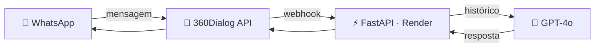

<div align="center">

<br/>

# Hi 👋 I'm Luís Otávio Guero

### Engenharia Aeroespacial @ UFSM · 3x Ouro em competições nacionais · Python + Embedded Systems + AI

<br/>

## 🔗 Connect with Me

[](https://linkedin.com/in/luisotavioguero)
[](https://github.com/zyzerkk)
[](mailto:contatoguero@gmail.com)
[](#)

<br/>

## 🧑‍💻 About Me

- 🚀 Capitão e programador do **CubeSat Halley** — 🥇 1° lugar nacional na OBSAT 2022 e 2023, com lançamento sub-orbital real (CLBI, Natal/RN)
- 🏢 **N1 → N3** em suporte técnico na Zucchetti, liderando migração e conversão de bancos de dados (FDB, PostgreSQL, MySQL, CSV)
- 🤖 Desenvolvo automações com IA (WhatsApp + OpenAI GPT-4o) e testes E2E automatizados (Playwright + Meta Pixel)
- 🧠 Pesquisando **NVIDIA Modulus** (Physics-ML) para Digital Twins no GEDRE/UFSM
- 🌱 Formação: Engenharia Aeroespacial (UFSM, 2023–presente) · Engenharia de Software (UNICESUMAR) · TI + Eletrotécnica (SESI SENAI)
- 💬 Pergunte-me sobre bancos de dados, sistemas embarcados C++, ou automação com IA

<br/>

## 🧠 Tech Stack

<p>

<br/>

</p>

<br/>

## 📊 GitHub Analytics


<br/>

## 🐍 Contribution Graph


<br/><br/>

</div>

## 🕓 Atividade Recente

> Seção viva — atualizada conforme o progresso real do que estou construindo agora.

**🧠 NVIDIA Modulus — Digital Twins & Physics-ML**
`UFSM · GEDRE (Grupo de Estudos de Reatores Eletrônicos)` · em andamento

Projeto Python de **Digital Twins com IA** dentro da iniciativa de Comunicação por Luz Visível (VLC) do GEDRE, usando o **NVIDIA Modulus** — framework de Physics-Informed Machine Learning — para modelar e simular sistemas físicos.

| Etapa | Status |
|:---|:---:|
| Tentativa inicial no Visual Studio Code | ❌ Abandonada (sem tutoriais compatíveis) |
| Migração para Google Colab (Python + GPU) | ✅ Concluída |
| Contorno de link quebrado no GitLab da Nvidia | ✅ Resolvido via fóruns/comunidades |
| Clonagem do repositório oficial (token pessoal) | ✅ Concluída |
| Instalação das dependências (`setup.py install`) | ✅ Concluída |
| Downgrade de versão do Python no Colab | 🟠 Em andamento |
| Execução do exemplo oficial da Nvidia | ⚪ Próximo passo |

```bash
# Ambiente: Google Colab (Python + GPU)
!git clone https://<username>:<token>@gitlab.com/nvidia/modulus/modulus.git
%cd ./modulus/
!python setup.py install
```

`Python` `NVIDIA Modulus` `Google Colab` `Physics-ML`

---

## 💼 Experiência Profissional

### Zucchetti Software e Sistemas — Suporte Técnico N1 → N3
`2021 – presente · +4 anos`

Iniciei no N1 e em **6 meses fui convidado a criar e liderar a equipe N2**. Promovido a **N3** pela capacidade de resolver problemas críticos que demandam conhecimento profundo de banco de dados, comportamento de sistema e debugging avançado.

**Responsabilidades N3:** correção de bugs em ERPs fiscais · restauração de bancos corrompidos via IBExpert · reparos em tabelas e índices Firebird (FDB) · análise de logs para diagnóstico de falhas · liderança técnica do time N2

**Especialidade — Migração e Conversão de Banco de Dados** `6 meses dedicados`

```sql
-- Pipeline de migração desenvolvido e executado em produção

-- 1. FDB → FDB: reestruturação de schema sem perda de dados
BACKUP DATABASE 'origem.fdb' TO 'backup.fbk';
RESTORE DATABASE 'backup.fbk' TO 'destino.fdb' PAGE_SIZE 8192;

-- 2. PostgreSQL → FDB: conversão de tipos e charset
-- PSQL uuid → FDB CHAR(36), PSQL jsonb → FDB BLOB SUB_TYPE TEXT

-- 3. CSV → FDB: importação massiva com validação
-- Limpeza de encoding, normalização de datas, deduplicação por chave

-- 4. MySQL → FDB: mapeamento de engines e collations
-- AUTO_INCREMENT → BEFORE INSERT trigger + NEXT VALUE FOR gen

-- 5. GDB → FDB: atualização de versão Firebird (<1.5 → 2.x/3.x/4.x)
```

**Ferramentas:** IBExpert · DB Visualizer · SQL Server · MySQL Workbench · MongoDB Compass · pgAdmin

---

## 🚀 Projetos em Destaque

### 🛰️ OBSAT — CubeSat Meteorológico · Equipe Halley


Capitão, programador e desenvolvedor estrutural de um **CubeSat meteorológico** para detecção antecipada de tornados e ciclones tropicais em Santa Catarina. Desenvolvido do zero, sem conhecimento prévio, evoluindo por 4 fases até o lançamento real.

**Arquitetura:** Computador de bordo em PION Labs (C++) · RF LoRa 433 MHz Helicoidal (30 dBi) · GPS + TinyGPS++ · Sensores de temperatura, pressão, CO₂, acelerômetro e giroscópio · Armazenamento redundante em SD duplo · Estrutura em Alumínio Aeronáutico 7075 (100×100×100 mm, 420 g)

```cpp
// Telemetria em tempo real — payload JSON enviado ao backend OBSAT
DynamicJsonDocument jsonBuffer(512);
jsonBuffer["equipe"]      = TEAM_NUM;
jsonBuffer["bateria"]     = cubeSat.getBattery();
jsonBuffer["temperatura"] = cubeSat.getTemperature();
jsonBuffer["pressao"]     = cubeSat.getPressure();
jsonBuffer["co2"]         = cubeSat.getCO2Level();

JsonArray accel = jsonBuffer.createNestedArray("acelerometro");
accel.add(cubeSat.getAccelerometer(0)); // X
accel.add(cubeSat.getAccelerometer(1)); // Y
accel.add(cubeSat.getAccelerometer(2)); // Z
```

**Testes de qualificação:**

| Teste | Condição | Resultado |
|:---|:---|:---:|
| ❄️ Criogênico | Gelo seco → −33.33 °C | ✅ Nenhum dano |
| 🔥 Térmico | Secador → +50.65 °C | ✅ Nenhum dano |
| 🌌 Vácuo | 946 → 6 mbar por 120s (parceria BRF) | ✅ Aprovado |
| 📳 Vibração | Simulação shaker, 5 repetições | ✅ Estrutura intacta |
| 🎈 Voo | Balão atmosférico ~40 km de altitude | ✅ Satélite ativo |

**Antena selecionada — Helicoidal:** 433 MHz · 30 dBi de ganho · 280 g · 100×66 mm. Escolhida por alta direcionalidade e ganho para longas distâncias sub-órbita→terra; dipolo, patch e monopolo foram descartados por ganho insuficiente ou banda estreita.

---

### 🤖 Automação de Atendimento via WhatsApp com IA

Backend Python que conecta WhatsApp Business a um LLM via API oficial, com memória contextual, fluxos de atendimento e deploy em produção.



```python
@app.post("/webhook")
async def receber_mensagem(req: Request):
    body = await req.json()
    numero, texto = body["from"], body["text"]["body"]

    if numero not in historico:
        historico[numero] = [{"role": "system", "content": PROMPT_MESTRE}]
    historico[numero].append({"role": "user", "content": texto})

    resposta = client.chat.completions.create(model="gpt-4o", messages=historico[numero])
    reply = resposta.choices[0].message.content
    historico[numero].append({"role": "assistant", "content": reply})

    await enviar_whatsapp(numero, reply)
```

**Entregáveis (6 semanas):** levantamento de requisitos · backend + webhook · prompt mestre · fluxos de atendimento · deploy Render · documentação · treinamento da equipe

---

### 🧪 Testes E2E Automatizados — Meta Pixel + Checkout

Suite Playwright que abre o criativo do anúncio, faz scroll comportamental, clica no CTA e preenche o checkout automaticamente, validando cada evento do Meta Pixel via interceptação de requisições HTTP em tempo real.

```
✓ PageView             — pixel inicializado e disparado
✓ InitiateCheckout     — evento ao clicar no CTA
✓ Scroll comportamental — simula usuário real
✓ Preenchimento checkout — todos os campos
✓ Smoke: fbq() presente — pixel carregado
✓ Desktop (Chrome) + Mobile (iPhone 14)
```

`TypeScript` `Playwright` `Meta Pixel API`

---

## 🏆 Premiações

| Medalha | Competição | Período | Contexto |
|:---:|:---|:---:|:---|
| 🥇 | OBSAT — Regional e Nacional | 2022 · 2023 | CubeSat · lançamento sub-orbital CLBI/RN |
| 🥇 | MOBFOG | 2020 · 2021 | Mostra Brasileira de Foguetes |
| 🥉 | Olimpíada de Foguetes Sólidos | 2021 | — |
| 🥉 | Olimpíada Canguru de Matemática | 2021 | — |
| 🥇 | Copa Brasileira Mangahigh | 2020 | Matemática |
| 🥉 | Copa Brasileira Mangahigh | 2019 | Matemática |

<br/>

<div align="center">

## 💬 Random Dev Quote


<br/><br/>

---

`contatoguero@gmail.com` · `Santa Maria, RS · Brasil` · [`linkedin.com/in/luisotavioguero`](https://linkedin.com/in/luisotavioguero)

</div>
